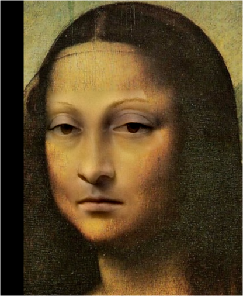
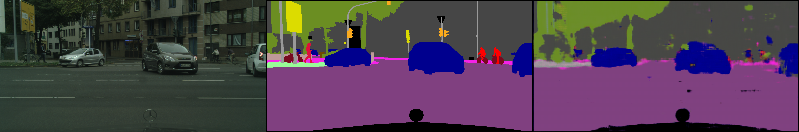

## Implementation of Image Geometric Transformation

This repository is Zhijun Wang's implementation of Assignment_02 of DIP. 

## Requirements

To install requirements:

使用conda配置环境
python 3.9.19
torch 1.13.1+cu117
gradio 3.36.1
numpy 1.26.4


## Running and Result

To run Poisson Image Editing, run:

```
python run_blending_gradio.py
```

*result:*
|前景|背景|结果|
| ---- | ---- | ---- |
||||


To run pix2pix, run:


```
cd Pix2Pix
python run_blending_gradio.py
```
*result:*
使用的数据集为：
[cityscapes-dataset](https://www.cityscapes-dataset.com/)

|||


