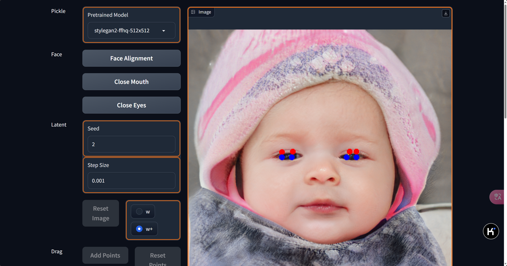
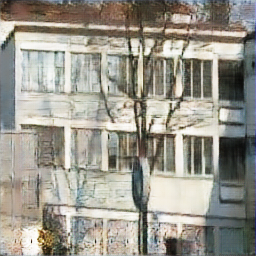
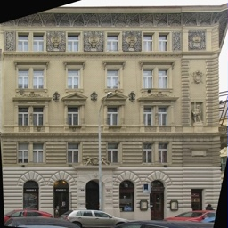
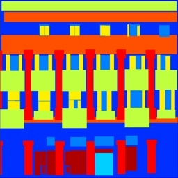
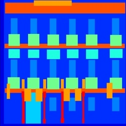
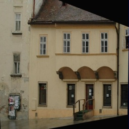

# Assignment 3 - Play with GANs

## Implementation of Play with GANs

This repository is Zhijun Wang's implementation of Assignment_03 of DIP. 

## Requirements

### Increment hw2 with Discriminative Loss


To install requirements:

使用conda配置环境

python 3.9.19

torch 1.13.1+cu117

numpy 1.26.4


### Make DragGAN Automatic with Facial Landmarks

1. install DragGAN firstly
from repo [DragGAN](https://github.com/XingangPan/DragGAN)

```bash
conda env create -f environment.yml
conda activate stylegan3
```

```bash
pip install -r requirements.txt
```

2. install face-alignment
from repo [face-alignment](https://github.com/1adrianb/face-alignment)

```bash
pip install face-alignment
```


## Running


### To run pix2pix, run:


```bash
cd Pix2Pix
python train.py
```
*result:*
使用的数据集为：
[Facades Dataset](https://cmp.felk.cvut.cz/~tylecr1/facade/)

### To run DragGAN, run:


```bash
cd DragGAN
python visualizer_drag_gradio.py
```
WebUI:


点击

Face Alignment

Close Mouth

Close Eyes

执行对应操作


## Result

### Pix2Pix

|input|generated|groud truth|
| ---- | ---- | ---- |
||||
||||
||||
||||
||||

### DragGAN

https://github.com/user-attachments/assets/1706638c-a679-49f8-b653-4e9c169d7539


